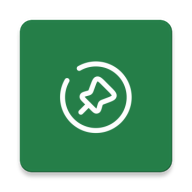
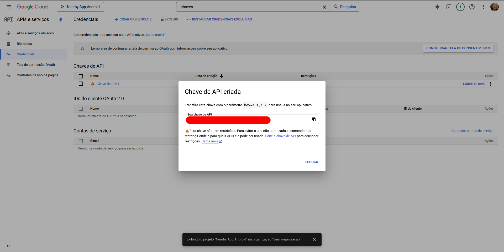
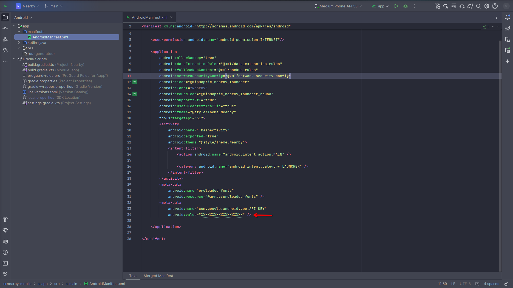
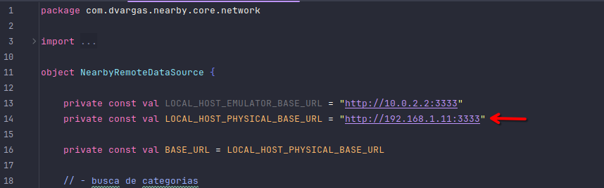
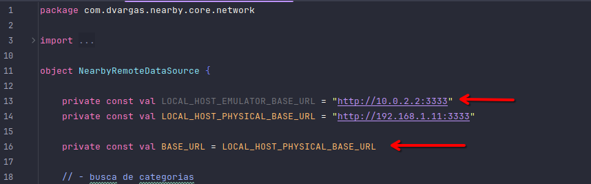

<h1 align="center">
  
</h1>

<h3 align="center">
  Nearby
</h3>

<p align="center">The best way to search for businesses while traveling </p>

<p align="center">
  

  <a href="https://www.linkedin.com/in/daniel-santos-040983ab/" target="_blank" rel="noopener noreferrer">
    
  </a>

  

  <a href="https://github.com/dvargas42/nearby-mobile/commits/master">
    
  </a>

  <a href="https://github.com/dvargas42/nearby-mobile/issues">
    
  </a>

  
</p>


## 📝 Table of Contents

- [ Overview](#-overview)
- [ Demo](#-demo)
- [ Technologies](#-technologie)
- [ Getting Started](#-getting-started)
  - [ Prerequisites](#-prerequisites)
  - [ Installation](#-installation)
- [ Contributing](#-contributing)
- [ License](#-license)


## 🔮 Overview

Mobile application developed with Kotlin that maps businesses such as markets, cines, restaurants, etc., close to the user.


## 👾 Demo

Movie of the application in operation.

**Running in android simulator:**


## 🚀 Technologies

Technologies that I used to develop this api

- [Java 11](https://www.oracle.com/br/java/technologies/javase/jdk11-archive-downloads.html)
- [Kotlin 2.0](https://zod.dev/)
- [Jetpack Compose](https://developer.android.com/jetpack/getting-started?hl=pt-br&_gl=1*1vfudk0*_up*MQ..&gclid=CjwKCAiAmfq6BhAsEiwAX1jsZ8CXGhgj1wVtRrkQVzM9y2pagj258u4o_rt1P79K-xEmPSy8v_v6AxoCxSkQAvD_BwE&gclsrc=aw.ds)
- [Maps Compose 4.3](https://github.com/googlemaps/android-maps-compose)
- [Zxing 3.5](https://github.com/zxing/zxing)
- [Ktor 3.0](https://ktor.io/)
- [Coil 3.0](https://coil-kt.github.io/coil/)


## 🛸 Getting Started

### Prerequisites

Before getting started with Nearby, ensure your runtime environment meets the following requirements:

- [Node 22.7](https://nodejs.org/en/)
- [npm](https://www.npmjs.com/)


## ⚙️ Installation

**Clone the project and access the folder**

```bash
$ git clone https://github.com/dvargas42/nearby-mobile.git
```
**Access the extras folder and copy the api.zip file to another location and unzip it. Inside the unzipped folder**

```bash
# Install the dependencies
$ npm i

# To run locally
$ npm run start

# Well done, api is started
```

**Create credential on Google Maps**

1. Access the link below and **follow the 3 steps** to add the Google Maps Platform map service to your project:

  - [https://developers.google.com/maps/get-started](https://developers.google.com/maps/get-started)

2. In the first step, you will need to **create your Google Cloud account** (don't worry, there will be no cost included)

3. Create a **new project** to be managed on this Google Cloud Console platform, linked to your account (ex: Nearby App Android)

4. Search for keys in the top search bar, see image, click on the “**+ CREATE CREDENTIALS**” button and choose **API Key**

    


5. Paste the key into the AndroidManifest.xml file

    


**Configuring a smartphone or simulator on Android Studio**

1. Run the ifconfig command on Linux or ipconfig on the Windows terminal to obtain the PC's IP.


2. The last step is to change the IP of the NearRemoteDataSource.kt file to the IP acquired in the previous step in LOCAL_HOST_PHYSICAL_BASE_URL variable. That is if you want to use your smartphone. 

    

3. If you want to use the simulator, just make the BASE_URL variable receive the LOCAL_HOST_EMULATOR_BASE_URL variable. 

    

4. Now is run the project in Android Studio. 


## 🔰 Contributing

**Make a fork of this repository**

```bash
# Fork using GitHub official command line
# If you don't have the GitHub CLI, use the web site to do that.

$ gh repo fork dvargas42/nearby-mobile
```

**Follow the steps below**

```bash
# Clone your fork
$ git clone your-fork-url && cd nearby-mobile

# Create a branch with your feature
$ git checkout -b my-feature

# Make the commit with your changes
$ git commit -m 'feat: My new feature'

# Send the code to your remote branch
$ git push origin my-feature
```

After your pull request is merged, you can delete your branch

## 🎗 License

This project is licensed under the MIT License - see the [LICENSE](LICENSE) file for details.

---

Made with 💜 &nbsp;by Daniel Vargas 👋 &nbsp;[See my linkedin](https://www.linkedin.com/in/daniel-santos-040983ab/)